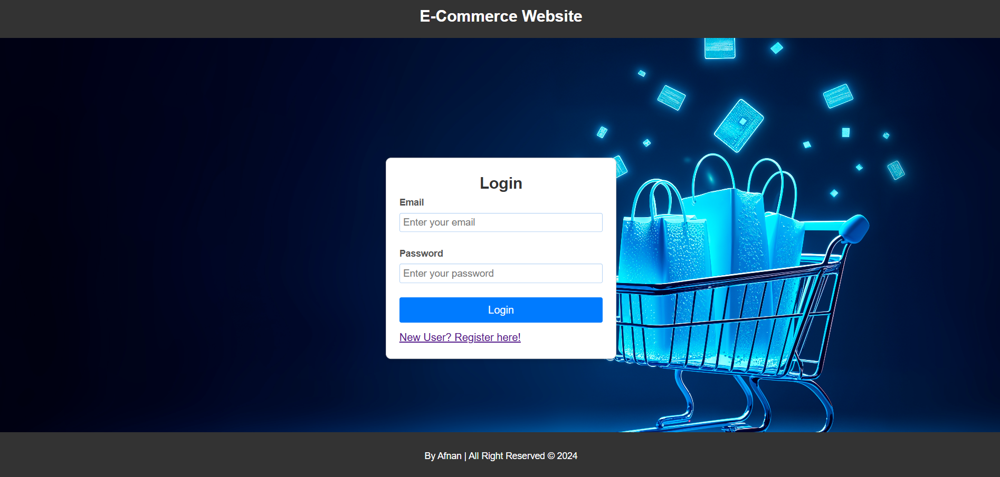
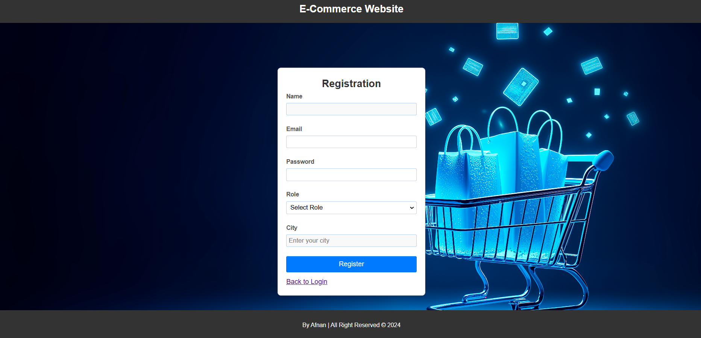
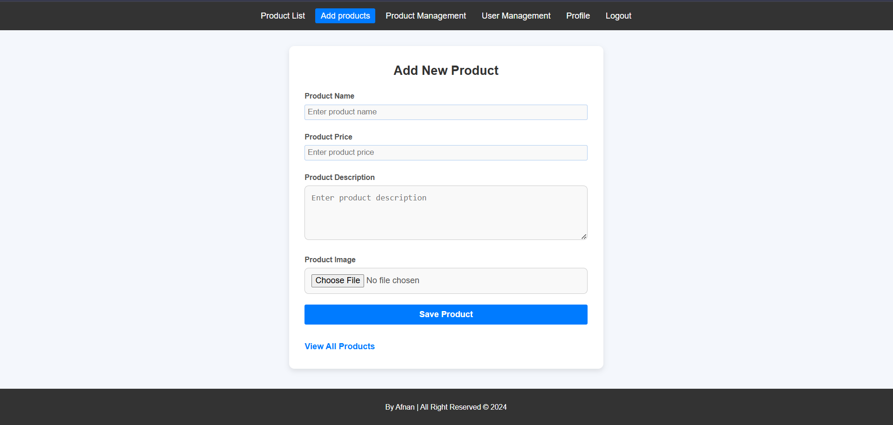
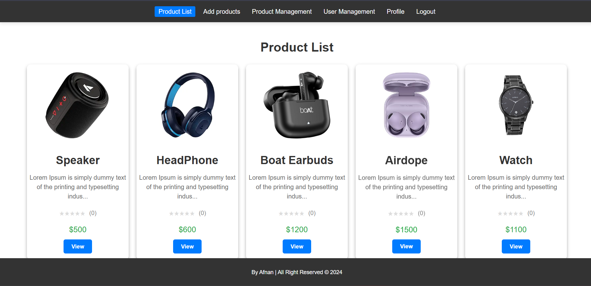
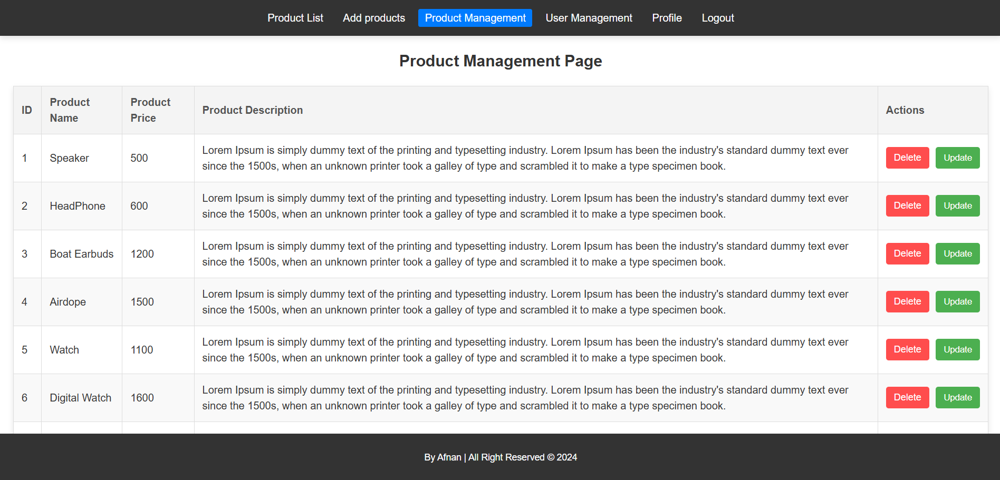
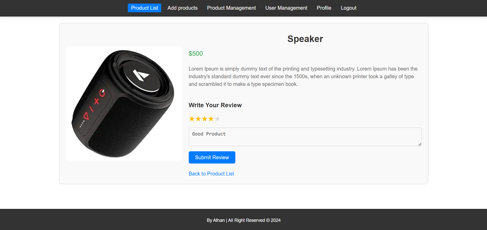
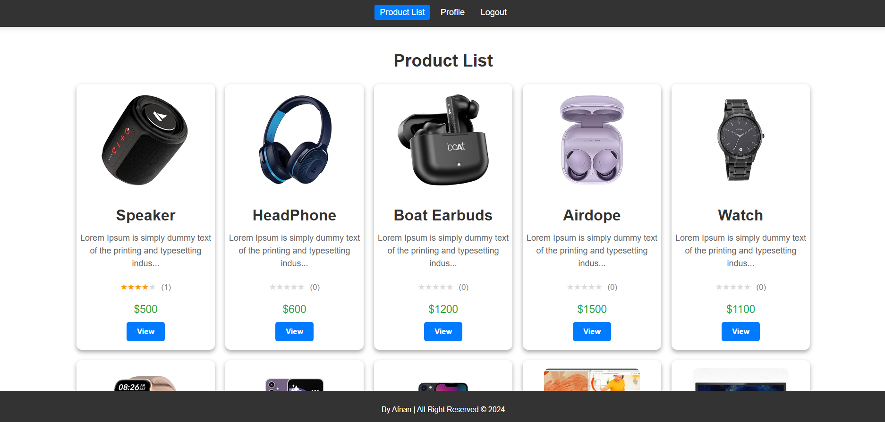
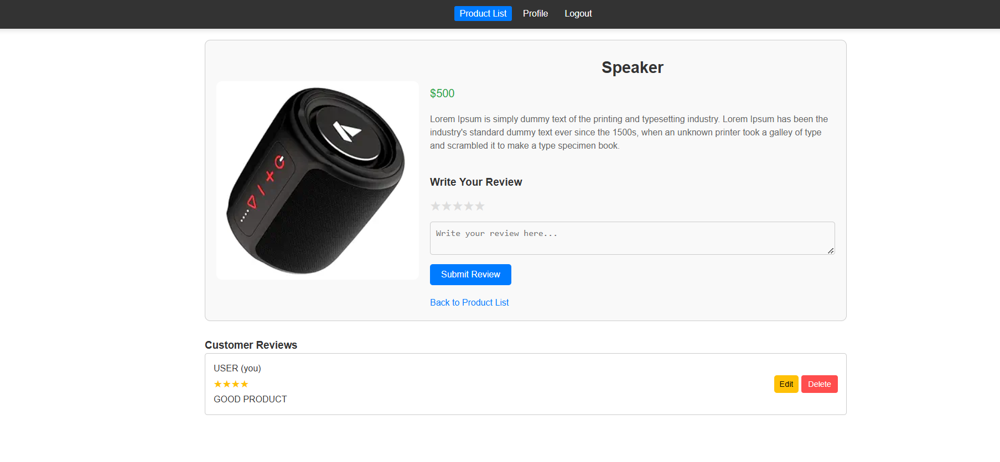

# Basic Product Management Ecommerce Website

## Description
This project is a simple e-commerce website designed to manage products. It includes features like user login, registration, product management, and product review/rating management.

## Modules
1. **Login**  
   - Users can log in to access their accounts.  
   - Includes error handling for incorrect credentials.  

2. **Registration**  
   - New users can sign up with valid credentials.  
   - Ensures secure password storage.  

3. **Product Management**  
   - Add, edit, delete, and view products.  

4. **Review/Rating Management**  
   - Users can leave reviews and ratings for products , also can add, edit , delete reviews.

---

## Installation
### 1. Clone the Repository
```bash
git clone https://github.com/AfnaAbubacker/E-COMMERCE-NEW.git

```
After cloning, you will find two folders:

- E-commerce-backend-main
- E-commerce-frontend-main

### 2. Backend Setup
step 1: Open  E-commerce-backend-main in your desired IDE.

Configure the Database <br>

step 2 : Open the application.properties file in src/main/resources and update the database connection details:
```bash
spring.datasource.url=jdbc:mysql://localhost:3306/product_management
spring.datasource.username=your_username
spring.datasource.password=your_password
```
step 3 : Run the Application

### 3. Frontend Setup

step 1: Open  E-commerce-frontend-main in your desired IDE.
        Install dependencies using npm.
        The application will run at 
```bash
http://localhost:3000
```

### Database Management

This project uses MySQL Workbench 8.0 for database management.

Create the Database
- Open MySQL Workbench and connect to your MySQL server.
- Run the following command to create the database:
```bash
CREATE DATABASE product_management;
```
---


#### LOGIN INTERFACE
- If you have already Registered, then Login using the same email and password.



#### REGISTRATION INTERFACE
- If you are a new user/admin, then register using the following details.



## ADMIN SECTION
#### ADMIN PRODUCT ADD SECTION
- This page is authorized for admin only. Admin can only add new product.



#### PRODUCT LIST 
- This page is where all the products are displayed for admin/user.


#### PRODUCT MANANGEMENT 
- This page allows the admin to edit or delete products as needed.


#### REVIEW/RATING 
- This page allows to add reviews and rating for the selected product.


## USER SECTION
#### USER PRODUCT LIST VIEW 
- This page is where all the products are displayed.


#### USER REVIEW/RATING
- This page is where user can give review and rating accordingly.



